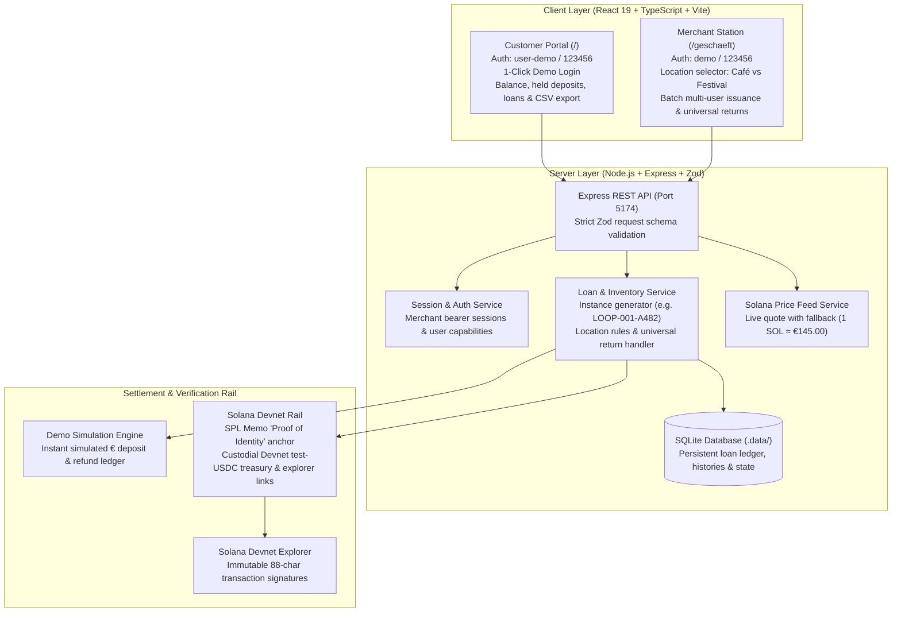
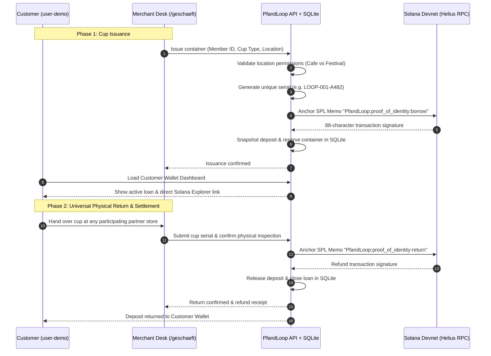

# PfandLoop · Together for our Environment 🌍

<div align="center">


**Decentralized, Micro-Settlement Deposit Loop for Reusable Containers & Festival Cups**  
*Built for the WHU Hackathon 2026 Challenge: Solana MVP Track*

[Quickstart](#-quickstart) • [Live Portals & Logins](#-portals--demo-credentials) • [Architecture](#-architecture) • [How It Works](#-how-it-works) • [Solana RPC Setup](#-solana-devnet--helius-rpc-setup) • [Strategic Outlook](#-strategic-outlook-recup-interoperability)

</div>

---

## 🌟 Vision & Problem Statement

Deposit loops for reusable coffee cups, bowls, and festival drinkware are broken by fragmentation:
- **App Silos**: Users must register with disparate proprietary apps and pre-fund locked wallet balances that sit unused.
- **Cross-Merchant Clearing**: Small cafés and festival stands struggle with manual bookkeeping, daily reconciliation, and cross-vendor settlement delays.
- **Lost Deposits**: Consumers forfeit deposits simply because returning a cup at an arbitrary partner venue is inconvenient or unsupported.

**PfandLoop solves this by combining universal physical returns with a high-speed, sub-cent Solana settlement rail.** Instead of locking money in proprietary apps, deposits are portable, verified, and settled instantly (<400ms, <$0.001 fee) directly on Solana Devnet.

---

## 🚀 Key Features

| Feature | Description |
| :--- | :--- |
| **Two Dedicated Portals** | Separate **Customer Wallet (`/`)** and staff **Merchant Station (`/geschaeft`)** with built-in 1-Click MVP Sign-In. |
| **Location-Based Cup Rules** | **Café Morgenrot (`cafe`)** issues Coffee Cups and Lunch Bowls. **Wiesenklang Festival (`festival`)** issues Festival Cups. |
| **Universal Return Desk** | Every partner location accepts and refunds **any** physically returned container, regardless of where it was issued. |
| **Infinite Container Volume** | Stores can issue unlimited containers with unique auto-generated serials (e.g. `LOOP-001-A482`) without stock lockups. |
| **Multi-User Batch Issuance** | Issue cups to multiple Member IDs at the same time in a single atomic action. |
| **On-Chain "Proof of Identity" Memo** | Anchors immutable borrow and refund memos on the **Solana SPL Memo program** with direct 88-char links to the **Solana Devnet Explorer**. |
| **Dynamic Solana Valuation** | Integrated live price estimation engine approximating **1 SOL ≈ €145.00** for transparent micro-deposit conversions. |
| **Persistent SQLite Store & CSV Export** | Complete transaction ledger with one-click full history CSV download. |

---

## 🔑 Portals & Demo Credentials

The platform provides dedicated interfaces for customers and partner merchants with convenient 1-Click buttons:

| Portal | URL | Credentials | Key Functionality |
| :--- | :--- | :--- | :--- |
| **Customer Wallet** | `http://localhost:5174/` | `user-demo` / `123456`<br>*(or click 1-Click Sign-In)* | Live balance (€20.00 initial), active cups, deposit ledger, 3D cup loop, CSV history export |
| **Merchant Station** | `http://localhost:5174/geschaeft` | `demo` / `123456`<br>*(or click 1-Click Sign-In)* | Location selector (`cafe` vs `festival`), batch issuance by Member ID, universal physical return desk |

---

## ☕ Container Catalog

All containers carry standard deposits and location authorization rules:

| Container | ID Code | Deposit (€) | Approx. SOL | Venue Issuance Authorization |
| :--- | :---: | :---: | :---: | :--- |
| **Coffee To-Go Cup** | `LOOP-001` | **€1.00** | ~0.0069 SOL | ☕ **Café Morgenrot** only |
| **Festival Reusable Cup** | `LOOP-002` | **€2.00** | ~0.0138 SOL | 🎪 **Wiesenklang Festival** only |
| **Lunch Bowl** | `LOOP-003` | **€5.00** | ~0.0345 SOL | ☕ **Café Morgenrot** only |

> **Note on Returns:** While issuance is location-restricted, **any partner venue accepts any container** for physical return and deposit refund!

---

## 🏗️ Architecture



---

## 🔄 How It Works



---

## ⚡ Quickstart

### Prerequisites
- **Node.js**: v24.0.0 or higher
- **npm**: v10.0.0 or higher

### Installation & Launch

```powershell
# 1. Clone repository
git clone https://github.com/blitzlive/SolanaChallange2026.git
cd SolanaChallange2026

# 2. Install dependencies
npm install

# 3. Start development server (serves both portals on port 5174)
npm run dev
```

Open your browser:
- **Customer Portal**: [http://localhost:5174/](http://localhost:5174/)
- **Merchant Station**: [http://localhost:5174/geschaeft](http://localhost:5174/geschaeft)

### Production Build

```powershell
npm run build
npm start
```

---

## 🌐 Solana Devnet & Helius RPC Setup

PfandLoop anchors real Proof-of-Identity memos directly on Solana Devnet. You can easily configure your own custom RPC to ensure maximum throughput:

### 1. Obtain a Free Helius API Key
1. Sign up for free at **[Helius.dev](https://helius.dev)** (or [QuickNode](https://quicknode.com)).
2. Create a new project and select **Solana Devnet**.
3. Copy your Devnet HTTP RPC URL (`https://devnet.helius-rpc.com/?api-key=YOUR_API_KEY`).

### 2. Configure Environment
1. Copy `.env.example` to `.env` (or run `npm run setup:devnet`):
   ```powershell
   cp .env.example .env
   ```
2. Set your custom RPC URL in `.env`:
   ```env
   SOLANA_RPC_URL=https://devnet.helius-rpc.com/?api-key=YOUR_API_KEY
   ```
3. Restart `npm run dev`.

---

## 🤝 Strategic Outlook: RECUP Interoperability

Germany's leading reusable container system, **RECUP**, operates across **20,000+ partner cafés and gastronomy spots**. However, traditional centralized systems suffer from:
1. **Balance Lock-in**: User funds are trapped inside individual vendor apps.
2. **High Clearing Costs**: Cross-merchant monthly invoicing creates substantial administrative friction.
3. **Siloed Standards**: Festivals, campus canteens, and city networks cannot easily interconnect.

**PfandLoop demonstrates the solution:**
- **Open On-Chain Settlement**: Solana settles cross-merchant claims in **<400ms for less than $0.001**.
- **No Locked App Balances**: Deposits are refunded immediately upon return.
- **Universal Hardware Compatibility**: Works with standard printed QR codes, NFC stickers, and RFID chips.

---

## 🔒 Security & Secret Safety Guarantee

We follow strict security and privacy standards:
- **Zero Secrets in Git**: All API keys, treasury keys (`TREASURY_SECRET_KEY`), and bearer tokens reside exclusively in local `.env` files.
- **Gitignore Protection**: `.env`, `.env.*` and `.data/` are strictly ignored by `.gitignore` and never committed or pushed to GitHub.
- **Input Validation**: Every API payload is validated with **Zod schemas** before reaching business logic.
- **Isolated Storage**: SQLite databases are kept in private `.data/` local directories.

---

## 🧪 Verification & Test Suite

PfandLoop is tested across unit, integration, and browser E2E test suites:

```powershell
# Type checking
npm run typecheck

# Unit & API test suite (Vitest)
npm test

# Production build test
npm run build

# Playwright E2E browser tests
npm run test:e2e
```

---

<div align="center">

**PfandLoop · WHU Hackathon 2026**  
*Making reusable cups effortless, universal, and fast with Solana.*

</div>
