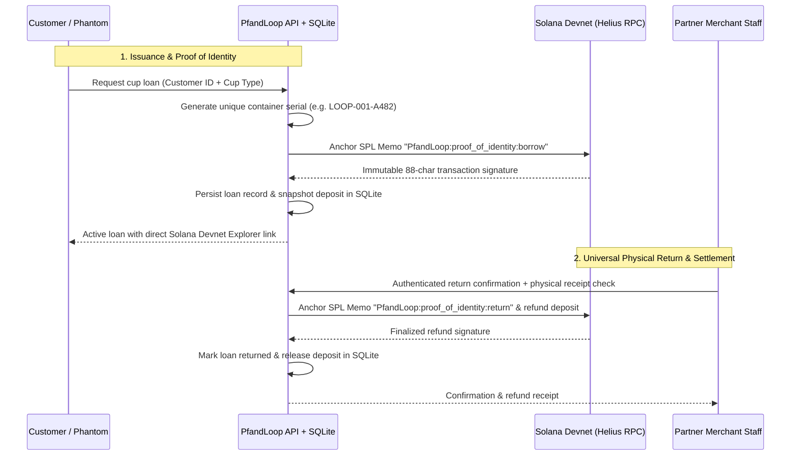

# PfandLoop: Together for our environment

PfandLoop is a reusable-container deposit MVP for cafes, buffets, and festivals. Customers access their personal **MVP Dashboard** to monitor their active cups, deposits, and transaction history. Participating merchants use the **Merchant Station** (`/geschaeft`) to issue cups to customers (by Member/User ID, with future QR scan support) and confirm physical cup returns with automated deposit refunds.

## Our response to the WHU Hackathon 2026 Solana challenge

**Our proposal connects an essential environmental action—reusing cups and closing container loops—to a high-speed, sub-cent Solana settlement rail.** Instead of proprietary app silos, PfandLoop creates an open, interoperable standard.

The supplied challenge asks participants to identify a real problem, build a usable MVP with at least one Solana feature, and explain its value and route to first users. PfandLoop focuses on:
1. **Customer Dashboard (`/`)**: Direct view of wallet balance, active cups held, transaction movements, and universal partner acceptance notice (*"All participating partner stores accept reusable cup returns"*).
2. **Merchant Station (`/geschaeft`)**: Streamlined cup issuance (**Ausgabe**) by Member ID and cup returns (**Rücknahme**) with physical verification and automated deposit refund.
3. **Realistic Solana Exchange Rate**: Offline MVP conversion rate updated to a realistic approximation: **1 SOL ≈ €145.00**.
4. **Strategic Outlook & RECUP Interoperability**: Open architecture designed to integrate with established networks (e.g., **RECUP** with 20,000+ locations, FairCup, Relevo) and festival organizers, unlocking frictionless cross-vendor clearing without locked-in app balances.

| Question | PfandLoop's answer |
| --- | --- |
| What problem are we solving? | German reusable deposit systems face fragmented vendor apps, locked-in user credits, and manual cross-merchant cash clearing. |
| Who benefits? | Customers returning cups anywhere, staff issuing/accepting containers effortlessly, and networks like RECUP scaling cross-vendor loops. |
| What does the MVP demonstrate? | Customer wallet dashboard, merchant cup issuance & returns by Member ID, instant automated refunds, and on-chain Devnet settlement. |
| Where does Solana fit? | Sub-cent transaction fees (<$0.001) and 400ms finality make €1.00 - €5.00 cup deposits economically viable on-chain without vendor lock-in. |
| What is the Strategic Outlook? | Cooperation and interoperability with established reusable leaders like RECUP, FairCup, and festival bars. |


| Challenge criterion | Product response | Evidence and remaining work |
| --- | --- | --- |
| A useful idea: a clear problem | People at multi-stand events need an easy way to return containers; participating businesses need to know which deposit to release and to whom. PfandLoop links the registered container, original payer and return confirmation. | The workflow is implemented. Interviews must validate the frequency and cost of this problem; no customer traction is claimed. |
| A working prototype: demonstrate the core idea | A customer borrows at one location and staff at another confirm receipt. The original deposit is released and the loan remains in the customer's demo history. | Local lifecycle, browser and payment-adapter tests are recorded. A live Devnet deposit/refund demonstration is still outstanding; simulation alone does not demonstrate the required Solana use. |
| A clear role for Solana | A shared token-payment rail returns deposits to the original wallet, with transaction signatures that can be inspected independently of the app. Staff at the receiving location trigger the common treasury's refund. | Devnet test-USDC adapter is implemented. Solana verifies payment, not physical return. Custody is centralized; merchant accounting and a custom escrow are not implemented. |
| Potential to grow: who would use it and why? | Start with one campus event and two stands. If customers complete returns easily and staff find the flow useful, extend the same registered-container network to nearby cafes and buffets. | Growth depends on measured operational benefit, reliable recovery, merchant onboarding, cleaning logistics and manageable wallet friction. No partnerships or adoption are assumed. |

### Making it understandable for intended users

The customer page leads with familiar €1/€2/€5 catalog prices, a container choice and one borrowing action. The business page separates staff sign-in and physical-return confirmation. The demo wallet provides current and historical loans plus a CSV export. The interface is German and has been checked at phone and desktop sizes. Blockchain-specific signing appears only in the explicit Devnet flow; that flow labels its actual test-USDC transfers separately from euro catalog prices. Mainstream wallet onboarding remains a pilot question.

### Reaching the first users

1. Approach one campus event organizer through the university entrepreneurship community and ask for introductions to two drink or food stands. This is a recruitment plan, not an existing agreement.
2. Interview the organizer and staff about returns and end-of-day reconciliation. Observe their current cash/card workflow before assuming it needs replacement.
3. Show the two-location prototype and recruit a small supervised test. The current software has three registered containers; adding a larger inventory comes after this first test. Keep Devnet tokens valueless and separate from real event deposits.
4. Record checkout/return completion, time spent by staff, failed refunds, wallet-onboarding abandonment and reconciliation effort. Ask customers whether returning at either stand made the experience easier.
5. Expand to additional campus locations only if the observed benefit outweighs extra steps and support effort. A real-money pilot needs separate custody, recovery and operational review.

### Suggested submission demonstration

First show the customer and business screens and explain the physical-return trust boundary. Then demonstrate a **real Devnet test transaction**: borrow with Phantom, verify the finalized test-USDC deposit, log in as the other business, confirm receipt and verify the finalized refund to the same customer wallet. Show the two transaction signatures in Explorer. Finally, use the separately labelled demo mode to show the complete loan history and CSV feature; real-wallet aggregate history is not yet available.

Prepare funded test wallets and complete this walkthrough before claiming the Solana requirement has been demonstrated. Keep credentials and private receipt IDs out of recordings. The existing adapter includes a loan-specific memo on-chain; receipts therefore need a privacy review before any real-money deployment.

### Submission requirements from the supplied brief

- **WHU Hackathon 2026 participation:** the submitting team must confirm its eligibility; this repository does not establish participation.
- **Working prototype using Solana:** the adapter and local tests exist; complete and record the live Devnet walkthrough above. The offline demo and illustrative SOL conversion alone are not sufficient evidence.
- **Pitch-deck link:** create a shareable deck and submit its URL in the **“Bounty submission link”** field. No deck URL or submission has been recorded here; this introduction is not a replacement for the required deck.
- **Public GitHub repository:** use [blitzlive/SolanaChallange2026](https://github.com/blitzlive/SolanaChallange2026) and confirm that judges can access it without signing in.
- **Follow Superteam Germany on X:** the submitting participant must follow [@SuperteamDE](https://x.com/SuperteamDE); completion has not been verified.

A concise deck can cover five slides: problem and first users; the two-location return flow; working prototype and demonstration; Solana's payment role and current limits; first-user recruitment and next milestones.

## Run the app

Install Node.js 24 or newer and npm, then run:

```sh
git clone https://github.com/blitzlive/SolanaChallange2026.git
cd SolanaChallange2026
npm install
npm run dev
```

Open the two portals on the same server:

- **Customer Portal:** `http://localhost:5174/` (Login: `user-demo` / `123456` or use 1-Click Sign-In)
- **Merchant Station:** `http://localhost:5174/geschaeft` (Login: `demo` / `123456` or use 1-Click Sign-In)

No wallet, credentials or real money are needed for the default demo. The customer wallet starts with **20 simulated euros**. All locations and activity created for demonstration are fictional.

## Customer walkthrough

1. **Sign in**: Open `http://localhost:5174/` and click the **1-Click MVP Sign-In** button (`user-demo` / `123456`).
2. **Dashboard Overview**: See your active wallet balance, total held deposits, active borrowed cups, and the live Solana price indicator (**1 SOL ≈ €145.00**).
3. **Borrow a Container**: Choose a container: coffee cup `LOOP-001` (€1.00), festival cup `LOOP-002` (€2.00) or lunch bowl `LOOP-003` (€5.00), select the issue location, and confirm deposit.
4. **Inspect Loan Details & Solana Proof**: View active loans with exact timestamp, container instance serial, deposit amount, and direct **Solana Devnet Explorer** links for on-chain Proof of Identity memos.
5. **CSV History Export**: Download complete transaction and loan logs using **CSV exportieren** with persistent SQLite backing.
6. **Universal Return Notice**: Every participating partner store accepts returns for any registered cup. Once staff confirms physical receipt, deposits are immediately refunded and wallet balance updates.

## Business walkthrough

1. **Sign in**: Open `http://localhost:5174/geschaeft` and click **1-Click Demo Login** (`demo` / `123456`).
2. **Select Partner Location**:
   - **Café Morgenrot (`cafe`)**: Permitted to issue **Coffee To-Go Cups (`LOOP-001`)** and **Lunch Bowls (`LOOP-003`)**. Festival cups are restricted.
   - **Wiesenklang Festival (`festival`)**: Permitted to issue **Festival Reusable Cups (`LOOP-002`)**. Standard coffee cups and lunch bowls are restricted.
3. **Infinite Container Issuance & Batch Mode**:
   - Issue containers without stock lockup; each cup receives an auto-generated unique instance identifier (e.g., `LOOP-001-A482`).
   - Support for **Multi-User Batch Issuance**: Enter multiple Member IDs separated by commas to issue cups simultaneously in one atomic step.
4. **Universal Return Desk**:
   - Enter the returned container serial or scan its QR code. Any partner location accepts any registered pilot cup.
   - Physically inspect and receive the container, tick **Ich habe den richtigen Behälter physisch entgegengenommen.**, and confirm the return.
   - The backend records physical possession, triggers the automated refund to the original stored payer, and anchors the return memo on Solana.

## How Solana is used

The platform integrates with **Solana Devnet** via SPL Token & SPL Memo programs:



- **Proof of Identity Memos:** Every borrow and return movement writes an immutable memo to the Solana blockchain (`PfandLoop:proof_of_identity:${user}:${cup}:${action}:${id}`).
- **Explorer Transparency:** Every transaction produces an 88-character signature linked directly to the Solana Devnet Explorer.
- **RPC Reliability:** Configurable custom Devnet RPC endpoint (Helius / QuickNode) via `SOLANA_RPC_URL` in `.env`.
- **Realistic Valuation:** Transparent offline and live pricing engine approximating **1 SOL ≈ €145.00** for sub-cent deposit calculations.

## Try the optional Devnet flow

1. Stop the demo server and run `npm run setup:devnet`. This creates a test operator wallet and merchant token in ignored `.env`; it refuses to overwrite an existing configuration.
2. Fund the operator with Devnet SOL via [Solana Faucet](https://faucet.solana.com/).
3. Configure your custom Helius Devnet RPC URL in `.env` to avoid public RPC rate limits.
4. Restart `npm run dev` and verify the status indicator shows **SOLANA DEVNET**.
5. Test issuing and returning containers with on-chain signatures and explorer verification.

## Current evidence and limits

The local verification recorded for this MVP comprises **unit/API/payment tests**, **Playwright browser tests**, a successful production TypeScript build and desktop/mobile visual inspection. Coverage includes cross-location returns, merchant authorization, location-based issuance constraints, multi-user batching, history isolation, CSV export, and original-payer refund safeguards. See [verification notes](docs/verification.md) for details.

The MVP demonstrates the open loop with merchant-confirmed physical returns, infinite issuance scalability, and a Solana Devnet audit rail. The strategic vision is partnering with leaders like **RECUP** to make reusable container loops frictionless, open, and instant across Europe.
