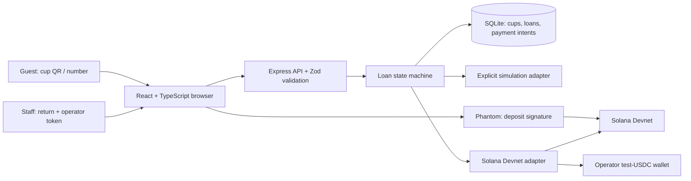

# PfandLoop architecture

## Scope and assumptions

Build a reusable-container deposit pilot for independent cafes and festival stands. The first vertical slice is borrow -> payment -> staff-verified return -> refund to the original payer. Two fictional locations and three registered containers make the demo reproducible. The user explicitly requested implementation; this document records the working assumptions for that first iteration.

- German, mobile-first browser interface; no PfandLoop account or installation.
- Demo mode works immediately without wallets, secrets or internet. It is visibly simulated and never presented as a blockchain transaction.
- Optional Solana **Devnet only** integration uses 3 test USDC, not EUR or EURC. Users need Phantom and test SOL for network fees/account creation.
- The first adapter uses a custodial operator wallet, **not a deployed escrow smart contract**. No real funds, mainnet, legal compliance or production readiness is claimed.
- Pilot scale: one Node process, SQLite on local disk, tens of simultaneous users. Expected local API latency below 300 ms; blockchain confirmations are asynchronous and not promised within one second.
- Operator maintains the service and funds test refunds/fees. Wallet addresses are pseudonymous, not anonymous. No names, emails or banking details are collected.
- Persistent states survive restarts; transactions with uncertain outcomes remain pending rather than triggering a second payout.

## Components

## State and payment boundaries

`available -> reserved -> borrowed -> refund_pending -> returned`.
Only one active loan per cup (SQLite partial unique index). The deposit is exactly 3,000,000 atomic USDC units. The server builds a transaction with a unique loan memo and stores the exact message. A submitted signature is accepted only after a successful finalized Devnet transaction with that exact message. This binds payer, mint, amount, destination, memo and blockhash together and blocks receipt substitution/replay. Store the signature uniquely.

Returns require the operator bearer token in Devnet and an explicit physical-receipt checkbox. The destination is always read from the original loan, never supplied by the return caller. Prepare and persist the signed refund before sending it. Retries send the same signed bytes, never a newly signed payment. An expired/failed ambiguous refund requires operator investigation; automatic transaction replacement is deliberately excluded from this slice.

Demo simulates transitions in the same database without real keys or network calls. Different database files isolate demo and Devnet. Demo staff access is deliberately public and labelled; bind the server to loopback by default.

## Security

Validate request bodies and environment with Zod. Parameterize SQLite queries. Use request size limits, same-origin mutation checks, rate limits and security headers. Keep private keys and operator token server-only in ignored `.env`. Do not expose RPC credentials to the client. Reject non-Devnet genesis hashes before constructing blockchain transactions. No public endpoint enumerates payer addresses; the random loan UUID acts as a receipt capability. Only opaque status is shown for occupied cups. Staff authentication uses constant-time comparison; never log tokens, keys or request bodies.

Physical return is a trust boundary: a printed QR code proves container identity, not physical possession. Authorized staff verify the object. QR cloning and dishonest staff need operational controls or stronger tags before a public pilot.

## Design contract

Cream paper background, ink-green typography, forest-green primary actions and a restrained lime accent. Editorial serif headlines with system sans-serif controls. A cup illustration is drawn as a small original SVG, not downloaded artwork. Two workspaces: borrow and return. The main action remains visible at phone width, labels are explicit, minimum 44px touch targets, focus outlines, live errors and success receipts. Include loading, empty, reserved, borrowed, wallet-missing, rejected-payment and pending-refund states. Respect reduced motion; avoid fabricated environmental statistics.

## Decisions

| Decision | Alternatives | Reason |
| --- | --- | --- |
| React/Vite + Express/SQLite | Next.js; browser-only mock | One small local process, real persistent workflow and testable server boundaries |
| Demo default + opt-in Devnet | Wallet required at first launch | Pitch is usable immediately while real network work remains explicit |
| Custodial test treasury for first slice | Custom Anchor escrow | No deployed contract/toolchain exists yet; avoid misrepresenting custody |
| Test USDC | EURC; SOL deposit | Stablecoin flow, official test mint; never conflate USD and EUR |
| Staff-authorized returns | Public QR-triggered refunds | Copied QR cannot authorize a payout |

## Next milestone

Deploy/test a token escrow program with per-loan PDA vaults, merchant authority, replay protection, refund-to-original-owner and explicit closure/rent rules. Then wallet-standard/mobile integration, sponsored fees, staff identities, reconciliation/recovery jobs, audit and pilot validation. No mainnet release until these are reviewed.
