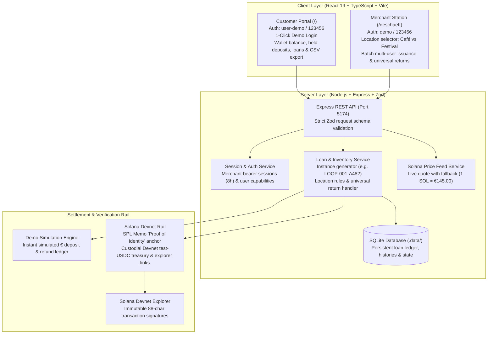

# PfandLoop: Project Instructions & Architecture Sketch

These project instructions supplement [AGENTS.md](AGENTS.md) and global development guidelines. For the product narrative and WHU Hackathon challenge responses, see [introduction.md](introduction.md); detailed architecture decisions are documented in [docs/architecture.md](docs/architecture.md).

---

## 1. System Architecture at a Glance



---

## 2. Core Workflows & Rules

### A. Location-Based Container Issuance Rules
- **Café Morgenrot (`cafe`)**: Authorized to issue **Coffee To-Go Cups (`LOOP-001`, €1.00)** and **Lunch Bowls (`LOOP-003`, €5.00)** only. Festival cups are strictly rejected.
- **Wiesenklang Festival (`festival`)**: Authorized to issue **Festival Reusable Cups (`LOOP-002`, €2.00)** only. Standard cups and bowls are strictly rejected.
- **Universal Return Desk**: Any partner location accepts and refunds **any** physically returned registered container, regardless of where it was originally issued.

### B. Infinite Container Issuance & Multi-User Batching
- Merchants can issue an arbitrary volume of containers without stock lockup. Every cup receives an auto-generated unique instance identifier (e.g., `LOOP-001-A482`).
- The Merchant Station supports multi-user batch issuance: multiple user IDs can receive cups in a single atomic transaction.

### C. Solana Devnet Anchor ("Proof of Identity" Memo)
- Each borrow and refund transaction anchors an on-chain Proof of Identity memo via the Solana SPL Memo program:
  `PfandLoop:proof_of_identity:${userId}:${cupInstanceId}:${action}:${loanId}`
- Customers and staff can click the 88-character transaction signature to verify the immutable proof on the official Solana Devnet Explorer.

---

## 3. Operational & Security Boundaries

1. **Zero Hardcoded Secrets**: Operator private keys (`TREASURY_SECRET_KEY`), RPC keys, and tokens live strictly in ignored `.env`. Never commit secrets or push them to GitHub.
2. **Simulation vs. On-Chain**: Default mode is self-contained local simulation. Solana Devnet uses test-USDC/test-SOL on Devnet cluster only; no mainnet or real EUR custody is claimed.
3. **Physical Custody vs. Blockchain**: Blockchain transactions guarantee deposit custody and refund integrity; physical inspection and cleaning remain human operational workflows.
4. **Authoritative Ledger**: SQLite is the authoritative local state engine; CSV exports and Devnet memos provide auditable external proofs.

---

## 4. Run & Verification Protocol

```powershell
npm install
npm run dev        # Starts app at http://localhost:5174/ and /geschaeft
npm run typecheck  # TypeScript compiler check
npm test           # Vitest unit & integration suite
npm run build      # Vite production bundle verification
```

