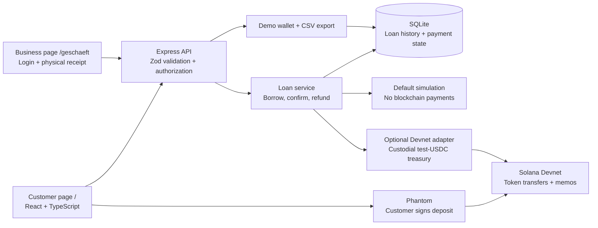

# PfandLoop: project instructions and architecture sketch

These project notes supplement [AGENTS.md](AGENTS.md). They do not replace the workspace's global development and verification rules. For the product walkthrough and WHU challenge response, see [introduction.md](introduction.md); detailed decisions are in [docs/architecture.md](docs/architecture.md).

## Architecture at a glance

**Stack and deployment:** React/Vite provides the two browser pages; one Node.js/Express process serves them and the API on port 5174. Zod validates input and configuration. SQLite persists loans locally, keeping demo and Devnet in separate database files. This keeps the MVP reproducible without extra services; it is a single-process pilot.

**Borrow flow:** The API validates a container and payer, reserves the container and snapshots its deposit amount. Demo mode immediately simulates payment. In Devnet, the customer signs with Phantom and the server verifies the finalized transaction against the exact stored message before marking the loan borrowed.

**Return flow:** An authenticated business session confirms physical receipt of any registered borrowed container, including one issued elsewhere. The service returns the original amount only to the stored original payer. Devnet refunds are signed and saved before submission; retries reuse those bytes. Finalized repayment closes the loan, while historical records remain available.

**History:** The demo customer's private browser capability authorizes balance, all-loan history and CSV access. Displayed user IDs are not credentials. SQLite is authoritative; CSV exports do not expose private wallet or receipt capabilities. There is no authenticated aggregate history for real Solana wallets yet.

## Boundaries to preserve

- Keep default simulation explicit. EUR prices and the illustrative SOL equivalent are UI values; the optional on-chain adapter transfers test USDC, with SOL used for fees. No mainnet, real EUR settlement or deployed custom escrow is implemented.
- Keep keys and operator credentials server-side in ignored `.env`. Never include them in frontend bundles, logs, documentation or commits.
- Require business authorization and physical receipt on both refund endpoints. Demo login is public simulation; Devnet login requires the operator credential. Business sessions bind actions to a location.
- Preserve one active loan per container, exact finalized deposit verification, original-payer refunds and stored-transaction retry safety. Do not automatically re-sign an uncertain refund.
- Physical return and cleaning are operational responsibilities, not blockchain proofs. Test-token custody remains with the operator.

## Run and verify

Run `npm install` and `npm run dev`; open `/` for customers or `/geschaeft` for staff. After backend changes run `npm test` and `npm run build`. After flow/UI changes also run `npm run test:e2e` and inspect affected screenshots. Update [verification notes](docs/verification.md) with observed results. A local simulation or mocked RPC test must not be presented as a completed live Solana demonstration.
