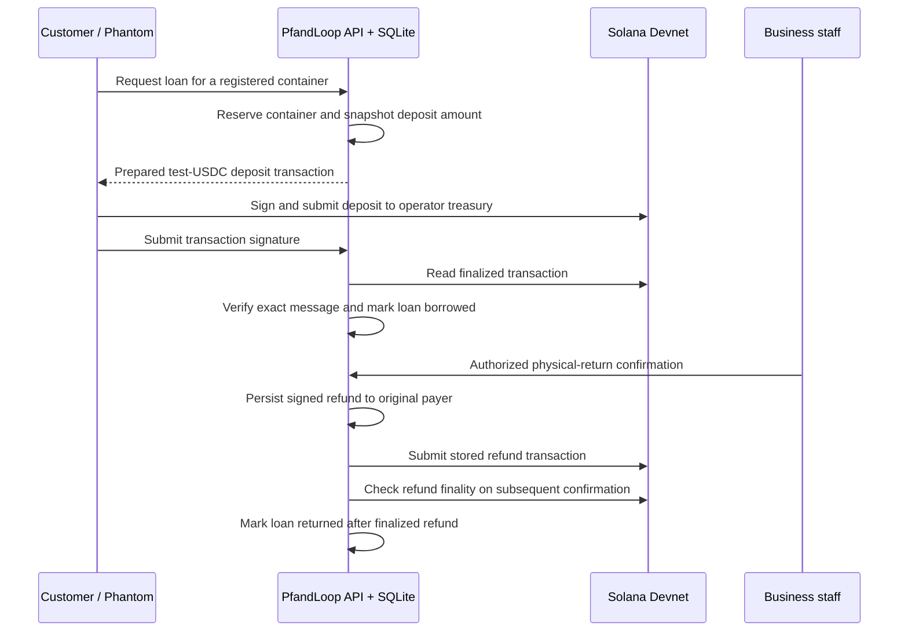

# PfandLoop: reusable containers, one shared deposit loop

PfandLoop is a reusable-container deposit MVP for cafes, buffets and festivals. Customers borrow at one participating business and return at another. Staff confirm physical receipt, and the deposit returns to the original payer. A customer wallet shows every past and current loan, with a CSV export for a portable overview.

## Our response to the WHU Hackathon 2026 Solana challenge

**Our proposal is to connect a familiar everyday action—returning a reusable cup—to a shared digital payment flow.** The deposit follows the borrower across participating businesses instead of requiring the original checkout location to handle the return.

The supplied challenge asks participants to identify a real problem, build a usable MVP with at least one Solana feature, and explain its value and route to first users. PfandLoop focuses on one complete feature: **borrow a reusable container at one business, return it at another, and refund the original payer after staff confirmation**. Its Solana feature is payments using the existing token and memo programs on Devnet.

| Question | PfandLoop's answer |
| --- | --- |
| What problem are we exploring? | How independent locations can share a deposit-and-return workflow with clear repayment records. Merchant demand and operational savings still need field validation. |
| Who benefits? | Customers returning cups or bowls, staff receiving them, and organizers coordinating several stands. |
| What does the MVP demonstrate? | Borrowing, persistent deposits, merchant-confirmed returns across locations, original-payer refunds and a complete customer loan history. |
| Where does Solana fit? | The optional Devnet adapter prepares and verifies test-token deposits and refunds through a common operator treasury. Transaction signatures provide independently inspectable payment evidence. |
| What remains off-chain? | Container registration, loan state, customer demo history and merchant authorization. Staff—not a QR code or blockchain—verify physical return. |
| What would a first pilot test? | One event with two stands: return completion, staff effort, customer onboarding and reconciliation, compared with existing cash/card processes. |

The intended benefit is interoperability between locations, not a claim that existing reuse systems require an app or that blockchain is necessary for every deposit. The demo works without blockchain; a pilot must establish whether shared wallet-based settlement adds enough value to justify onboarding and custody costs.

### How the project addresses the judging criteria

| Challenge criterion | Product response | Evidence and remaining work |
| --- | --- | --- |
| A useful idea: a clear problem | People at multi-stand events need an easy way to return containers; participating businesses need to know which deposit to release and to whom. PfandLoop links the registered container, original payer and return confirmation. | The workflow is implemented. Interviews must validate the frequency and cost of this problem; no customer traction is claimed. |
| A working prototype: demonstrate the core idea | A customer borrows at one location and staff at another confirm receipt. The original deposit is released and the loan remains in the customer's demo history. | Local lifecycle, browser and payment-adapter tests are recorded. A live Devnet deposit/refund demonstration is still outstanding; simulation alone does not demonstrate the required Solana use. |
| A clear role for Solana | A shared token-payment rail returns deposits to the original wallet, with transaction signatures that can be inspected independently of the app. Staff at the receiving location trigger the common treasury's refund. | Devnet test-USDC adapter is implemented. Solana verifies payment, not physical return. Custody is centralized; merchant accounting and a custom escrow are not implemented. |
| Potential to grow: who would use it and why? | Start with one campus event and two stands. If customers complete returns easily and staff find the flow useful, extend the same registered-container network to nearby cafes and buffets. | Growth depends on measured operational benefit, reliable recovery, merchant onboarding, cleaning logistics and manageable wallet friction. No partnerships or adoption are assumed. |

### Making it understandable for intended users

The customer page leads with familiar €1/€2/€5 catalog prices, a container choice and one borrowing action. The business page separates staff sign-in and physical-return confirmation. The demo wallet provides current and historical loans plus a CSV export. The interface is German and has been checked at phone and desktop sizes. Blockchain-specific signing appears only in the explicit Devnet flow; that flow labels its actual test-USDC transfers separately from euro catalog prices. Mainstream wallet onboarding remains a pilot question.

### Reaching the first users

1. Approach one campus event organizer through the university entrepreneurship community and ask for introductions to two drink or food stands. This is a recruitment plan, not an existing agreement.
2. Interview the organizer and staff about returns and end-of-day reconciliation. Observe their current cash/card workflow before assuming it needs replacement.
3. Show the two-location prototype and recruit a small supervised test. The current software has three registered containers; adding a larger inventory comes after this first test. Keep Devnet tokens valueless and separate from real event deposits.
4. Record checkout/return completion, time spent by staff, failed refunds, wallet-onboarding abandonment and reconciliation effort. Ask customers whether returning at either stand made the experience easier.
5. Expand to additional campus locations only if the observed benefit outweighs extra steps and support effort. A real-money pilot needs separate custody, recovery and operational review.

### Suggested submission demonstration

First show the customer and business screens and explain the physical-return trust boundary. Then demonstrate a **real Devnet test transaction**: borrow with Phantom, verify the finalized test-USDC deposit, log in as the other business, confirm receipt and verify the finalized refund to the same customer wallet. Show the two transaction signatures in Explorer. Finally, use the separately labelled demo mode to show the complete loan history and CSV feature; real-wallet aggregate history is not yet available.

Prepare funded test wallets and complete this walkthrough before claiming the Solana requirement has been demonstrated. Keep credentials and private receipt IDs out of recordings. The existing adapter includes a loan-specific memo on-chain; receipts therefore need a privacy review before any real-money deployment.

### Submission requirements from the supplied brief

- **WHU Hackathon 2026 participation:** the submitting team must confirm its eligibility; this repository does not establish participation.
- **Working prototype using Solana:** the adapter and local tests exist; complete and record the live Devnet walkthrough above. The offline demo and illustrative SOL conversion alone are not sufficient evidence.
- **Pitch-deck link:** create a shareable deck and submit its URL in the **“Bounty submission link”** field. No deck URL or submission has been recorded here; this introduction is not a replacement for the required deck.
- **Public GitHub repository:** use [blitzlive/SolanaChallange2026](https://github.com/blitzlive/SolanaChallange2026) and confirm that judges can access it without signing in.
- **Follow Superteam Germany on X:** the submitting participant must follow [@SuperteamDE](https://x.com/SuperteamDE); completion has not been verified.

A concise deck can cover five slides: problem and first users; the two-location return flow; working prototype and demonstration; Solana's payment role and current limits; first-user recruitment and next milestones.

## Run the app

Install Node.js 24 or newer and npm, then run:

```sh
git clone https://github.com/blitzlive/SolanaChallange2026.git
cd SolanaChallange2026
npm install
npm run dev
```

Open the two pages on the same server:

- **Customer:** `http://localhost:5174/`
- **Business:** `http://localhost:5174/geschaeft`

No wallet, credentials or real money are needed for the default demo. Its customer balance starts with **20 simulated euros**. All locations and activity created for demonstration are fictional.

## Customer walkthrough

1. Choose a container: coffee cup `LOOP-001` (€1), festival cup `LOOP-002` (€2) or lunch bowl `LOOP-003` (€5).
2. Select the issue location and click **Pfand hinterlegen · Demo starten**. The app records the loan and holds its simulated deposit.
3. Open **Demo-Wallet**. It shows your public user ID, available balance, deposits held and every container loan, including previous returns and repeated loans of the same container.
4. Switch between **Alle Ausleihen** and **Noch offen**, or use **CSV exportieren** to download the complete history with dates, locations and status. SQLite is the persistent database; CSV is a read-only export.
5. Hand the container to a participating business. A customer cannot confirm their own return from the customer page.
6. After staff confirmation, reopen the wallet or select **Guthaben aktualisieren**. The deposit is released and the returned loan remains in the history.

The demo identity stays in the current browser. Clearing browser storage creates a different profile. The displayed user ID is not a login credential. The complete wallet history and CSV are demo features; authenticated history for real Solana wallets is not implemented.

## Business walkthrough

1. Open **Geschäftsseite**, including from a separate browser if desired.
2. Select a business and click **Demo-Geschäft anmelden**. Demo sign-in is deliberately public and simulated.
3. Enter the returned container's number. Every participating business accepts every registered pilot container, regardless of where it was issued. Unknown containers must be registered before they can participate.
4. Physically inspect and receive the container, then tick **Ich habe den richtigen Behälter physisch entgegengenommen.**
5. Click **Rückgabe bestätigen**. The backend requires a valid business session, binds the return to that business, and refunds the original stored payer and deposit amount.
6. Use **Abmelden** when finished. Sessions expire after eight hours or server restart; reloading the business page also requires signing in again.

To demonstrate the open loop, borrow at **Café Morgenrot** and return at **Wiesenklang Festival**. Only one active loan can exist per container. The three catalog entries represent three individually registered containers, not unlimited stocks of each type.

## How Solana is used

The optional adapter runs on **Solana Devnet only**. Its current implementation transfers **test USDC**, not euros or native SOL deposits. The EUR catalog and the small SOL estimate are presentation features; the displayed rate **1 SOL = €100** is a labelled offline example, not a live quote or currency conversion.



- **Deposits:** The backend builds a token transfer and a loan-specific memo. Phantom signs for the customer. A loan is paid only after a successful finalized transaction matches the exact stored transaction message.
- **Custody:** Test funds are held in an operator wallet. There is no deployed custom escrow smart contract or per-loan on-chain vault.
- **Returns:** Staff confirmation triggers a refund to the original stored wallet; the return caller cannot choose a different recipient or amount.
- **Retry safety:** The signed refund is persisted before submission. Retries reuse the same signed bytes; an uncertain or expired refund requires operator investigation rather than a newly signed payment.
- **SOL:** Devnet SOL pays network fees and, when necessary, token-account creation costs. It is separate from the test-USDC deposit.
- **Evidence:** Devnet receipts link transaction signatures to Solana Explorer. Container ownership, physical possession and merchant honesty are not proven by those transfers.

The application uses Solana's existing token and memo programs. The next proposed on-chain milestone is a reviewed escrow program with per-loan vaults and merchant authority, followed by recovery procedures and simpler wallet onboarding. These are future work, not current features.

## Try the optional Devnet flow

1. Stop the demo server and run `npm run setup:devnet`. This creates a test operator wallet and merchant token in ignored `.env`; it refuses to overwrite an existing configuration.
2. Fund the operator with Devnet SOL. Use a separate customer Phantom wallet with Devnet SOL and enough test USDC for the selected 1/2/5 test-token deposit.
3. Restart `npm run dev` and verify the header says **SOLANA DEVNET**.
4. Borrow a container, approve the Phantom transaction and use **Zahlung prüfen** to confirm finalization. Do not pay again while a submitted payment is pending.
5. On the business page, log in using the operator credential, receive the container and confirm the return. Use **Rückzahlung prüfen** until finalization; do not create a replacement payout for an uncertain result.

See the [README](README.md#optional-devnet-setup) for setup, faucet links, environment variables and troubleshooting boundaries. No live Devnet transfer has been verified for this submission; network and wallet interaction still require that walkthrough with funded test wallets.

## Current evidence and limits

The local verification recorded for this MVP comprises **36 unit/API/payment tests**, **6 browser tests**, a successful production build and desktop/mobile visual inspection. Coverage includes cross-location returns, merchant authorization, history isolation, CSV export and original-payer refund safeguards. See [verification notes](docs/verification.md) for the scope and reproduction commands.

The MVP has no production staff identity management, live EUR/SOL rates, real EUR settlement, mainnet deployment, deployed escrow, merchant balance settlement or automated resolution of ambiguous payments. Container transport, cleaning and QR-cloning resistance also require operational solutions. No measured adoption, environmental savings or production readiness is claimed.

**Challenge pitch:** Borrow here, return there, receive your deposit back. PfandLoop demonstrates an open reuse loop with merchant-confirmed physical returns and an optional Solana test-payment rail. The goal is to make small everyday deposits portable between independent businesses, while keeping the user experience understandable in euros.
